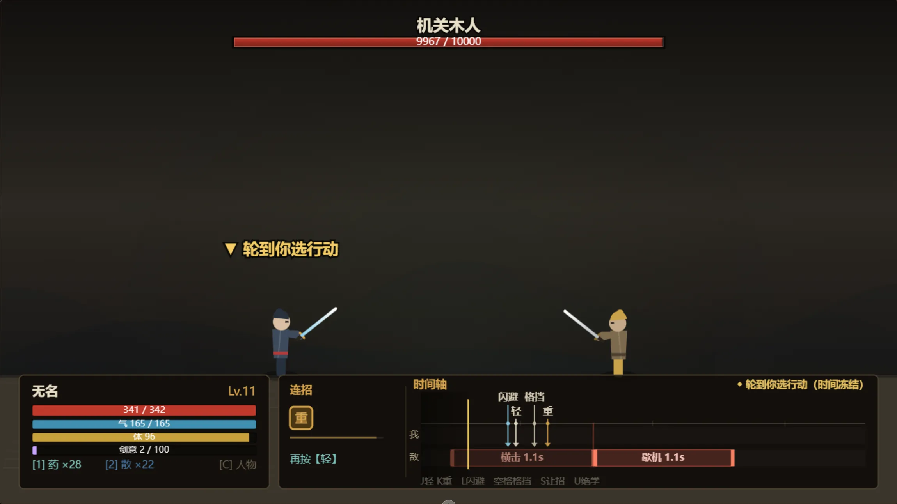
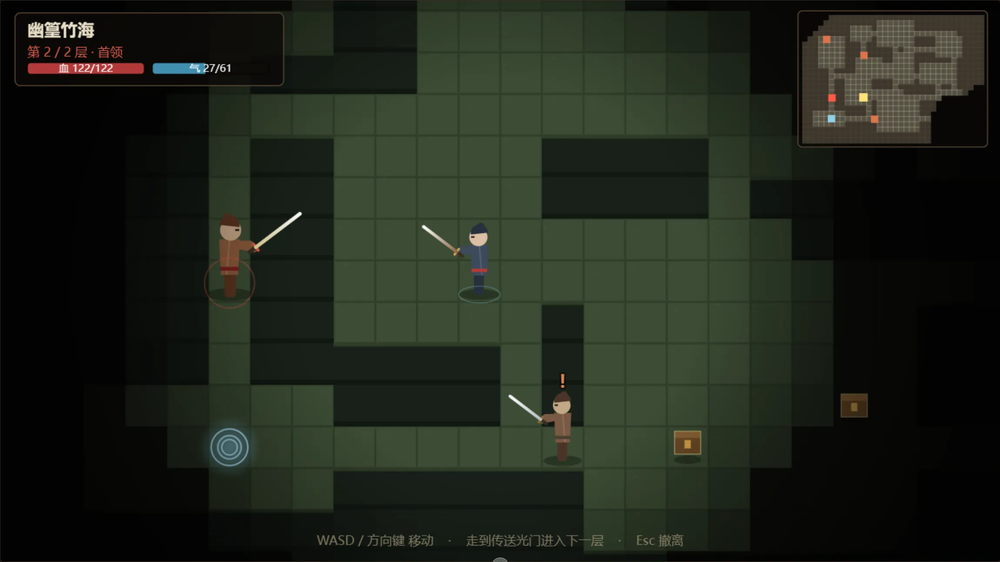
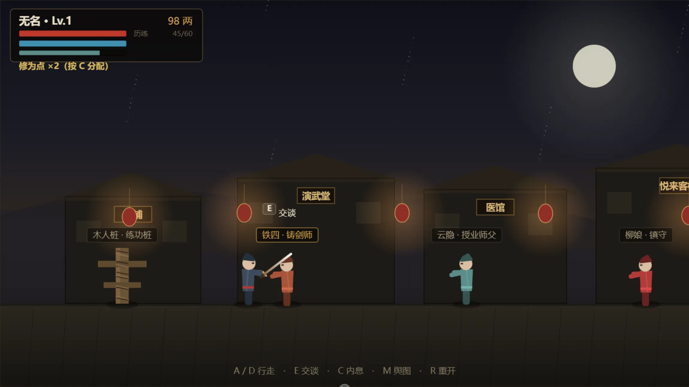
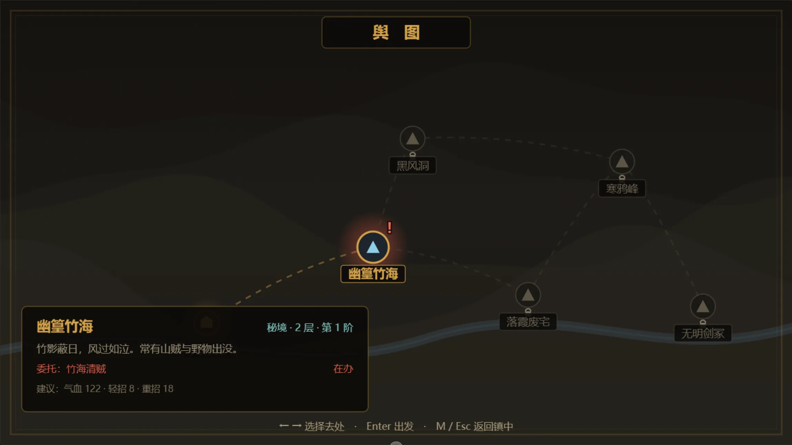

# 无明剑 · 2D 武侠 Roguelite

一柄无名之剑，一座无明小镇。在时间轴上读招、接招、连招的武侠肉鸽。

- **搓招**：按「轻」「重」组成序列，凑出六式剑招与一剑绝学
- **读轴**：敌我共处一条时间轴，看清对方何时出手，再决定抢攻、闪避还是格挡
- **肉鸽**：秘境随机生成、逐层深入，败则丢局，回镇再来

在线体验 [点我试玩](https://atakhalo.github.io/WuMing-ds/)

## 截图
<table>
	<tr>
		<td align="center"></td>
		<td align="center"></td>
	</tr>
	<tr>
		<td align="center"><b>战斗</b></td>
		<td align="center"><b>副本地图</b></td>
	</tr>
	<tr>
		<td align="center"></td>
		<td align="center"></td>
	</tr>
	<tr>
		<td align="center"><b>基地</b></td>
		<td align="center"><b>世界地图</b></td>
</table>

## 操作

| 场景 | 按键 | 说明 |
| --- | --- | --- |
| 通用 | `↑↓` `Enter` | 菜单选择 / 确认 |
| 基地 | `A` `D` | 左右行走 |
| 基地 | `E` | 与身旁 NPC 交谈 |
| 基地 | `C` | 打开内息与行装（分配修为点） |
| 基地 | `M` | 查看舆图（世界地图） |
| 基地 | `R` | **重开一局**（清空进度，需二次确认） |
| 副本 | `WASD` / 方向键 | 四向逐格移动 |
| 副本 | `C` | **查看人物**（与战斗中同一张面板）；打开时地图冻结 |
| 副本 | `Esc` | 撤离（丢失本局进度） |
| 战斗 | `J` | 轻击（表演 0.26s + 轴段 0.36s） |
| 战斗 | `K` | 重击（表演 0.36s + 轴段 0.60s） |
| 战斗 | `U` | 绝学「无明剑意」，**剑意满**时可放（表演 0.75s + 轴段 1.10s），放后剑意清零；剑意只在秘境中积攒 |
| 战斗 | `L` | **闪避**：轴段 0.30s，若敌人出手落在其中则完全免伤，耗体 20 |
| 战斗 | `空格` | **格挡**：轴段 0.50s，落在其中的攻击减伤 55%（段首 0.20s 内则招架），耗体 12；**会打断连招** |
| 战斗 | `S` | **让招**：轴段 0.30s（与闪避同长），只推移时间以调整节奏／回气，不耗体；**会打断连招** |
| 战斗 | `1` `2` | 服金创药 / 行气散 |
| 战斗 | `C` | **查看人物**（当前气血内力体力剑意、身手、兵装、剑谱）；打开时战斗冻结 |
| 战斗 | `Esc` | 脱离战斗 |

> 以上每个键都是在**轮到你时**选择「本回合要排进时间轴的行动」。
> 表演期间不接受任何指令；选完之后一切交给时间轴。

## 战斗核心：表演不入轴，时间轴只记行动段

战斗由**一条时间轴**驱动。关键规则是：**动作表演期间时间轴完全暂停**，
所以轴上出现的每一段，都只表示「cd 时间」或「闪避／格挡时间」。

指针所在处是「现在」：左侧只留一小段**已走过**的回忆区（约全宽的 1/10，会压暗），
其余全是**将要发生**的部分。轮到你时，候选行动画**下箭头**（**不带时长文字**），
箭头**穿过时间轴与我方整条行动条，一直指到两方行动条之间**——
竖线落在哪个时刻，就是选它之后时间会推进到哪。选定后箭头才化为行动条。

四个候选的标签分两排：**防御在上（闪避／格挡）、攻击在下（轻／重）**，
这样四个标签挤在两排里也互不遮挡：

```
 现在                         闪避↓  格挡↓          ← 上排：防御
  ▼                           轻↓    重↓            ← 下排：攻击
 ─┴────────────────────────────┼──────┼────────  时间轴
 我  ┌────── 行动条 ───────────┼──────┼──────┐
 ──────────────────────────────┼──────┼────────   ← 箭头穿过时间轴与我方整条行动条
 敌 │ ┌ 劈砍 0.9s ┐             ▼      ▼             ← 尖端落在两方行动条之间
      ▲出手
```

**流程**

1. 时间轴推进到**我方的行动点** → 时间**冻结**，等你选一个行动；
   四个候选以**下箭头**标在轴上，箭头穿过时间轴与我方整条行动条、
   尖端落在两方行动条之间，竖线所在的刻度就是该行动的轴段终点。
   箭头与下方敌方行动条同刻度对齐，一眼看出「选哪条能接住下一次出手」。
2. 选定后箭头化为一条**行动条**；先播放**表演**（挥剑、挡架、命中飘字），
   这一段**时间轴完全不动**。
3. 表演结束，该行动条才开始在轴上走动（cd 或防御段），时间轴恢复推进。
   条上**没有进度填充**——它保持完整，随指针推进自然向左滑过指针，
   滑过指针的部分转为「已走过」（压暗）。
4. 推进到**敌方的行动点** → 敌人出手（表演同样不入轴）。
   **表演期间敌方行动条不隐藏**，方便你对照自己正处在哪一段。

敌方接下来几步其实早就排好了，但轴上**最多画两条**，每条代表一次出手：

| 段 | 起点 | 长度 |
| --- | --- | --- |
| **过去的行动**（压暗） | 它最近一次出手的时刻 | 到下一次出手的 cd |
| **将要的行动** | 它下一次出手的时刻 | 到再下一次出手的 cd |

两条都是**从那次出手的时刻起画**，长度就是它自己的 cd，段内标注**招式名 + 这一段时长**。
敌方出手的那一刻，两条一起向后接一段；演出期间也照样在轴上，不会消失。

敌人招式分三类，可据此调整节奏：

| 类型 | 表现 | 对玩家的意义 |
| --- | --- | --- |
| **攻击** | 起手 → 命中 → 收招，部分带连击 | 需要在它的出手落点上排好闪避／格挡 |
| **防御** | 敌人受到的伤害降至 25%～45%（即减伤 55%～75%） | 硬拼不划算，适合让招／回气／整备连招 |
| **歇息** | 敌人回血 | 留给你输出或补状态的窗口 |

后两类是刻意留出的**节奏调节点**：敌人不会永远在进攻，
你有余地攒体力、排长连招，而不是被迫一直防御。

防御**不是一瞬间的事**：从它抬手那一刻起，到它下一次出手为止，这段时间打它都只掉两三成血。
轴上那一段会画成**青灰色的「守 · 招式名」**（普通攻击段是红色），敌人头顶也一直挂着「守」——
看到这两种标记，就别把连招砸在这段上，改成让招、回气、或干脆等它过去。

**闪避、格挡、让招都不需要即时反应**：它们本身就是排在轴上的行动段。
如果敌人的出手落点**落在你某个防御段之内**，就自动判定成功——

- **闪避**（轴段 0.30s，耗体 20）：完全免伤
- **格挡**（轴段 0.50s，耗体 12）：减伤 55%；若出手落在**段的最初 0.20s** 内，则升级为**招架**（敌人硬直，你回气 18）
- **让招**（轴段 0.30s，与闪避同长）：不出招，只让时间轴往前走一段，不耗体

所以战斗的判断是「读轴」：看清敌人在轴上的哪一刻出手，
再决定选哪一段去接它——是格挡硬吃、闪避躲开，还是抢在它之前把这一招打完。

**防御段都比基础招式短**（闪避 0.30s < 轻击 0.36s，格挡 0.50s < 重击 0.60s）：
它们不是「按下去就安全」的护盾，而是一小段**恰好罩住敌人出手点**的窗口。
按早了、按晚了都会白掉体力，所以别一路按着防——**先看轴上敌人出手落在哪**，
能抢完一招就抢，抢不完再拿防御去接。闪避窗口最窄、也最贵（20 体力），
换来完全免伤；格挡窗口宽些、便宜些（12 体力），但要吃下 45% 的伤害。

> 代价设计：**闪避／格挡段内不回复体力**，所以不能靠连续防御无限拖；
> 而「让招」不耗体力、回体为正（一段 26 × 0.30 = 7.8，连让两下就凑得出一次轻击），
> 所以体力见底时总能靠它慢慢回升，不会被永久卡住。
> 体力不足时游戏**不会替你自动做决定**，只会提示，由你自己选择。

**内力（气）怎么回**——主要靠打中对手，站着不动几乎不回：

| 来源 | 回气 |
| --- | --- |
| 轻击命中 | +7 |
| 重击命中 | +12 |
| 连招的每一段命中 | +3 |
| 招架成功 | +18 |
| 服「行气散」 | 按药力 |
| 时间轴推进 | 1.2 × 聚气 ／ 秒 |

最后一条**只在时间轴推进时生效**：轮到你思考（时间冻结）和出招表演期间都不回气。
演武场的木人桩同样算「命中」，所以在那里练连招时气照样回。

**剑意（绝学资源）怎么攒**——出招就有，跟内力和体力都不一样：

| 来源 | 剑意 |
| --- | --- |
| 每记基础招式（轻／重） | +2 |
| 每记连招 | +12 |
| 绝学「无明剑意」 | **消耗满槽 100**，伤害 = 剑意 × 1.35 × 攻击倍率 |

剑意**只在一次秘境探索内保留**：同一趟秘境里，这场战斗攒下的剑意带到下一场；
上到更深一层也还在。**一出秘境（通关／撤离／战败回镇）就散尽**，下次进去从零再攒。

所以一趟秘境里可以打出好几次绝学，但别指望把它熬到下一趟。
秘境地图左上角有一条紫色的「意」条，走图时也能看见攒到哪了。

**演武场里也能攒剑意**（对着木人试试绝学的手感），但**打完出来就清空**，带不回镇上。

**演武场**（无明镇的木人桩）备了两具木人：

| 选项 | 对手 | 用途 |
| --- | --- | --- |
| 演武 · 木人桩 | 不还手，血显示为 ∞ | 安心练轻重与连招，不怕挨打 |
| 演武 · 机关木人 | 会还手（10000 气血，攻击／防御／歇息三类俱全） | 练读轴：闪避、格挡、招架、抢招都得在这上面试 |

演武里被打空气血只是收场，**不计死亡、不丢进度、也不给奖励**。

连招表是**唯一对应**的：同一串「轻」「重」不会既是短招、又是某个长招的开头，
所以按下最后一击的瞬间就出招，没有等待判定，也不会有手感延迟。

| 序列 | 招式 | 耗气 | 表演 | 轴段（cd） |
| --- | --- | --- | --- | --- |
| 轻 · 重 | 撩云式 | 16 | 0.61s | 0.30s |
| 重 · 轻 | 截脉手（打断） | 20 | 0.75s | 0.35s |
| 轻 · 轻 · 轻 | 风卷残云 | 22 | 0.75s | 0.35s |
| 轻 · 轻 · 重 | 白虹贯日（穿透） | 30 | 1.03s | 0.55s |
| 重 · 重 · 轻 | 碎星击（击退） | 26 | 1.11s | 0.60s |
| 重 · 重 · 重 | 天崩地裂（破防） | 48 | 1.35s | 1.00s |

> 基础招式：轻击 表演 0.26s + 轴段 0.36s，耗体 9；重击 表演 0.36s + 轴段 0.60s，耗体 19。
> 实测节奏约「我方 1 个行动 ↔ 敌人出手 1 次」，开局第一击约在 0.3–0.6s 后落下。

**接续**：招式使完之后，有的本身就抵得上一个基础招式，会接进新序列继续搓——

| 招式 | 接续为 | 于是可以这样接 |
| --- | --- | --- |
| 风卷残云 | 轻 | 轻轻轻 → 风卷残云 → 再按两下轻 → 又一段风卷残云 → …（内力够就能一路滚） |
| 白虹贯日 | 重 | 白虹贯日 → 重 → 重 → **天崩地裂** |

其余招式（撩云式、截脉手、碎星击、天崩地裂）使完序列清空。连招框里，
接续来的那一项写着招式名（如「风卷」），底下那道色条标出它这次算「轻」还是「重」。

**格挡与让招都会打断连招**：举剑架招、收手让招时都顾不上续招，攒到一半的序列就此作废——
想搓长连招，就别拿它们去顶这一击。**只有闪避不影响序列**。

## 循环

```
无明镇（养成：淬炼兵器 / 学剑招 / 买丹药 / 接委托）
   ↓  舆图选择秘境
秘境（随机格子地图 · 逐层深入 · 拾取 / 巡逻敌人）
   ↓  接触敌人
战斗（时间轴搓招）
   ↓  胜利得历练与银两；失败丢掉本局进度并损失部分银两
回镇 → 变强 → 挑战更高阶秘境
```

- 秘境层数高者为**首领层**，需击败首领才能使用出口。
- 通关秘境即完成对应委托，开启下一处地点。
- 升级会得到**修为点**，在城里按 `C` 分配；属性影响气血、伤害与出招速度。

## 遇到问题

**双击没反应 / 一直停在「正在起剑」**
确认打开的是 `index.html`。如果打开的是 `index-dev.html`，那不是给玩家用的版本
（它需要本地服务器），页面上会直接说明原因。

**进度丢了**
存档在这个浏览器本地。换了浏览器、换台电脑，或者用了无痕模式，进度都不会跟过去。

**想彻底重来**
在城里按 `R`，再按 `空格` / `回车` 确认。会清掉存档、局外统计和当前这一局。

## 想改代码？

技术实现、打包机制、目录结构、时间轴模型与自测脚本都在
[DEVELOPMENT.md](DEVELOPMENT.md)。
