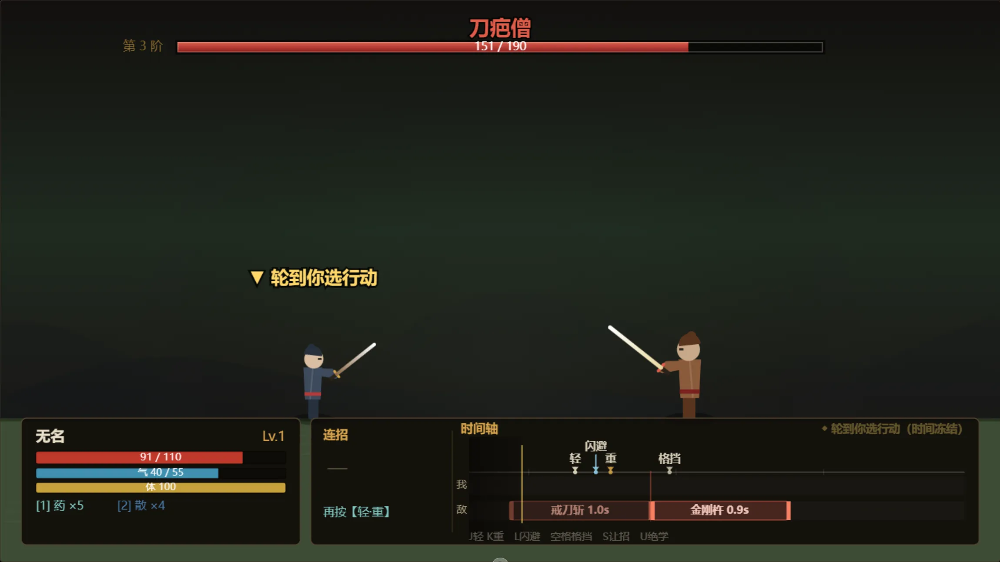

# 无明剑 · 2D 武侠 Roguelite

一柄无名之剑，一座无明小镇。在时间轴上读招、接招、连招的武侠肉鸽。

- **搓招**：按「轻」「重」组成序列，凑出六式剑招与一剑绝学
- **读轴**：敌我共处一条时间轴，看清对方何时出手，再决定抢攻、闪避还是格挡
- **肉鸽**：秘境随机生成、逐层深入，败则丢局，回镇再来

## 截图
## 截图
<table>
	<tr>
		<td align="center"></td>
		<td align="center"></td>
	</tr>
	<tr>
		<td align="center"><b>战斗</b></td>
		<td align="center"><b>副本地图</b></td>
	</tr>
	<tr>
		<td align="center"></td>
		<td align="center"></td>
	</tr>
	<tr>
		<td align="center"><b>基地</b></td>
		<td align="center"><b>世界地图</b></td>
</table>

## 操作

| 场景 | 按键 | 说明 |
| --- | --- | --- |
| 通用 | `↑↓` `Enter` | 菜单选择 / 确认 |
| 基地 | `A` `D` | 左右行走 |
| 基地 | `E` | 与身旁 NPC 交谈 |
| 基地 | `C` | 打开内息与行装（分配修为点） |
| 基地 | `M` | 查看舆图（世界地图） |
| 基地 | `R` | **重开一局**（清空进度，需二次确认） |
| 副本 | `WASD` / 方向键 | 四向逐格移动 |
| 副本 | `Esc` | 撤离（丢失本局进度） |
| 战斗 | `J` | 轻击（表演 0.26s + 轴段 0.36s） |
| 战斗 | `K` | 重击（表演 0.36s + 轴段 0.60s） |
| 战斗 | `U` | 绝学「无明剑意」，消耗全部内力（需 ≥40），表演 0.75s + 轴段 1.65s |
| 战斗 | `L` | **闪避**：轴段 0.50s，若敌人出手落在其中则完全免伤，耗体 20 |
| 战斗 | `空格` | **格挡**：轴段 1.00s，落在其中的攻击减伤 55%（段首 0.30s 内则招架），耗体 20 |
| 战斗 | `S` | **让招**：轴段 0.36s（与轻击同长），只推移时间以调整节奏／回气，不耗体 |
| 战斗 | `1` `2` | 服金创药 / 行气散 |
| 战斗 | `Esc` | 脱离战斗 |

> 以上每个键都是在**轮到你时**选择「本回合要排进时间轴的行动」。
> 表演期间不接受任何指令；选完之后一切交给时间轴。

## 战斗核心：表演不入轴，时间轴只记行动段

战斗由**一条时间轴**驱动。关键规则是：**动作表演期间时间轴完全暂停**，
所以轴上出现的每一段，都只表示「cd 时间」或「闪避／格挡时间」。

指针所在处是「现在」：左侧只留一小段**已走过**的回忆区（约全宽的 1/10，会压暗），
其余全是**将要发生**的部分。轮到你时，候选行动只在轴上画**下箭头**表示落点，
**不带时长文字**——选定后箭头才化为行动条。

```
 现在                              轻↓         重↓
  ▼                                 │           │
 ─┴─────────────────────────────────┴───────────┴────  时间轴
 我 │              ┌── 格挡 1.00s ──┘                  ← 选定后箭头化为行动条
 ───┼──────────────────────────────────────────────────
 敌 │ ┌ 劈砍 0.9s ┐┌────── 背刺 0.8s ──────┐           ← 最多两条
      ▲出手      ▲出手                                 （亮红竖标＝出手时刻，也是两段的分界）
```

**流程**

1. 时间轴推进到**我方的行动点** → 时间**冻结**，等你选一个行动；
   四个候选以**下箭头**标在轴上，箭头落点就是该行动的轴段终点。
   箭头与下方敌方行动条同刻度对齐，一眼看出「选哪条能接住下一次出手」。
2. 选定后箭头化为一条**行动条**；先播放**表演**（挥剑、挡架、命中飘字），
   这一段**时间轴完全不动**。
3. 表演结束，该行动条才开始在轴上走动（cd 或防御段），时间轴恢复推进。
   条上**没有进度填充**——它保持完整，随指针推进自然向左滑过指针，
   滑过指针的部分转为「已走过」（压暗）。
4. 推进到**敌方的行动点** → 敌人出手（表演同样不入轴）。
   **表演期间敌方行动条不隐藏**，方便你对照自己正处在哪一段。

敌方接下来几步其实早就排好了，但轴上**最多画两条**，每条代表一次出手：

| 段 | 起点 | 长度 |
| --- | --- | --- |
| **过去的行动**（压暗） | 它最近一次出手的时刻 | 到下一次出手的 cd |
| **将要的行动** | 它下一次出手的时刻 | 到再下一次出手的 cd |

两条都是**从那次出手的时刻起画**，长度就是它自己的 cd，段内标注**招式名 + 这一段时长**。
敌方出手的那一刻，两条一起向后接一段；演出期间也照样在轴上，不会消失。

敌人招式分三类，可据此调整节奏：

| 类型 | 表现 | 对玩家的意义 |
| --- | --- | --- |
| **攻击** | 起手 → 命中 → 收招，部分带连击 | 需要在它的出手落点上排好闪避／格挡 |
| **防御** | 敌人受到的伤害降至 25%～45%（即减伤 55%～75%） | 硬拼不划算，适合让招／回气／整备连招 |
| **歇息** | 敌人回血 | 留给你输出或补状态的窗口 |

后两类是刻意留出的**节奏调节点**：敌人不会永远在进攻，
你有余地攒体力、排长连招，而不是被迫一直防御。

**闪避、格挡、让招都不需要即时反应**：它们本身就是排在轴上的行动段。
如果敌人的出手落点**落在你某个防御段之内**，就自动判定成功——

- **闪避**（轴段 0.50s）：完全免伤
- **格挡**（轴段 1.00s）：减伤 55%；若出手落在**段的最初 0.30s** 内，则升级为**招架**（敌人硬直，你回气 18）
- **让招**（轴段 0.36s，与轻击同长）：不出招，只让时间轴往前走一段，不耗体

所以战斗的判断是「读轴」：看清敌人在轴上的哪一刻出手，
再决定选哪一段去接它——是格挡硬吃、闪避躲开，还是抢在它之前把这一招打完。

> 代价设计：**闪避／格挡段内不回复体力**，所以不能靠连续防御无限拖；
> 而「让招」不耗体力，且这一段的回体量（26 × 0.36 ≈ 9.4）刚好够一次轻击，
> 所以体力见底时总能靠它攒出下一手，不会被永久卡住。
> 体力不足时游戏**不会替你自动做决定**，只会提示，由你自己选择。

连招表是**唯一对应**的：同一串「轻」「重」不会既是短招、又是某个长招的开头，
所以按下最后一击的瞬间就出招，没有等待判定，也不会有手感延迟。

| 序列 | 招式 | 耗气 | 表演 | 轴段（cd） |
| --- | --- | --- | --- | --- |
| 轻 · 重 | 撩云式 | 16 | 0.61s | 0.30s |
| 重 · 轻 | 截脉手（打断） | 20 | 0.75s | 0.35s |
| 轻 · 轻 · 轻 | 风卷残云 | 22 | 0.75s | 0.35s |
| 轻 · 轻 · 重 | 白虹贯日（穿透） | 30 | 1.03s | 0.55s |
| 重 · 重 · 轻 | 碎星击（击退） | 26 | 1.11s | 0.60s |
| 重 · 重 · 重 | 天崩地裂（破防） | 48 | 1.35s | 1.00s |

> 基础招式：轻击 表演 0.26s + 轴段 0.36s，耗体 9；重击 表演 0.36s + 轴段 0.60s，耗体 19。
> 实测节奏约「我方 1–2 个行动 ↔ 敌人出手 1 次」，开局第一击约在 0.5–1.0s 后落下。

## 循环

```
无明镇（养成：淬炼兵器 / 学剑招 / 买丹药 / 接委托）
   ↓  舆图选择秘境
秘境（随机格子地图 · 逐层深入 · 拾取 / 巡逻敌人）
   ↓  接触敌人
战斗（时间轴搓招）
   ↓  胜利得历练与银两；失败丢掉本局进度并损失部分银两
回镇 → 变强 → 挑战更高阶秘境
```

- 秘境层数高者为**首领层**，需击败首领才能使用出口。
- 通关秘境即完成对应委托，开启下一处地点。
- 升级会得到**修为点**，在城里按 `C` 分配；属性影响气血、伤害与出招速度。

## 遇到问题

**双击没反应 / 一直停在「正在起剑」**
确认打开的是 `index.html`。如果打开的是 `index-dev.html`，那不是给玩家用的版本
（它需要本地服务器），页面上会直接说明原因。

**进度丢了**
存档在这个浏览器本地。换了浏览器、换台电脑，或者用了无痕模式，进度都不会跟过去。

**想彻底重来**
在城里按 `R`，再按 `空格` / `回车` 确认。会清掉存档、局外统计和当前这一局。

## 想改代码？

技术实现、打包机制、目录结构、时间轴模型与自测脚本都在
[DEVELOPMENT.md](DEVELOPMENT.md)。
